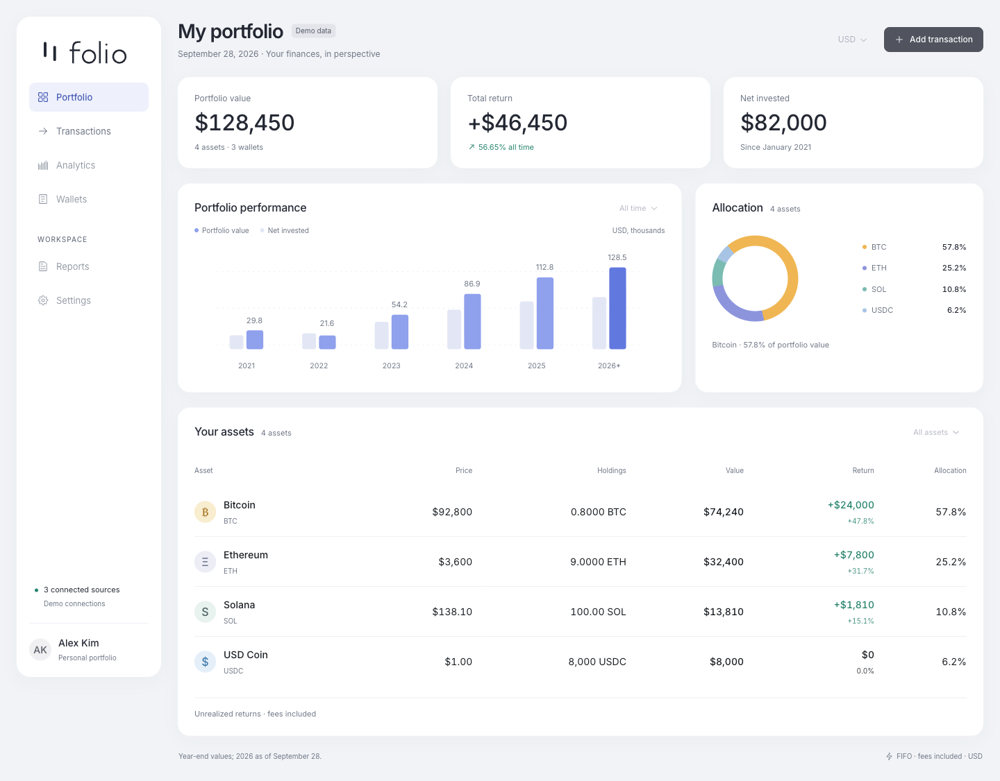

<picture>
  <source media="(prefers-color-scheme: dark)" srcset=".github/assets/folio-logo-dark.svg" />
  
</picture>

A React + TypeScript portfolio UI built with Radix Themes, a Laravel 13 API
served by FrankenPHP and Octane, and PostgreSQL 18. Caddy is the application
entry point. The UI currently uses static demo data; business actions are disabled.



[Mobile preview](.github/assets/folio-mobile.png)

## Requirements

- Docker Engine and Docker Compose 2.24.4 or later.
- Make and internet access for image and dependency downloads.

Node.js, PHP, Composer, and PostgreSQL do not need to be installed on the host.

## Development

Run from the project root:

```sh
make init
make up
make logs
```

Open **<http://127.0.0.1:8080>** after the services start. Caddy serves the
frontend and forwards `/api`, `/api/*`, and `/up` to Laravel. Frontend changes
refresh automatically, including WebSocket connections through Caddy.

`make init` builds the development images, creates `.env` from `.env.example`,
adds missing settings, and generates `APP_KEY` and `POSTGRES_PASSWORD` only if
they are empty. Existing settings and secrets are preserved. It then installs
Composer and npm dependencies and runs `octane:install --server=frankenphp`.
Custom Octane configuration is preserved. The previous
`COMPOSE_FILE=compose.yaml` default is upgraded to the development file list;
custom lists are preserved.
Keep the generated `src/backend/composer.lock` in version control alongside
`src/frontend/package-lock.json` for reproducible builds.

Source code is mounted from `src/frontend` and `src/backend`. Dependencies live
in their `node_modules` and `vendor` directories inside those same bind mounts.
There is no separate `node_modules` volume. Backend commands and workers run
as the non-root `appuser`. Make exports the host UID/GID as development build
arguments to keep Composer, the environment initializer, and source bind mounts
writable by the same user. The one-off permissions step in `make init` uses root
to repair storage, bootstrap cache, and dependency ownership from earlier builds;
the server runs as `appuser`.

All four core services start together without selecting profiles. The default
`COMPOSE_FILE` loads `compose.yaml:compose.dev.yaml`. Make commands select files
explicitly, so production never inherits development settings from `.env`.
Laravel waits for PostgreSQL readiness, and Caddy starts after frontend HTTP
and backend HTTP health checks succeed.

### Development ports

| Service | Host address | Container port |
| --- | --- | --- |
| Caddy (application) | `127.0.0.1:8080` | `80` |
| Frontend (direct Vite access) | `127.0.0.1:5173` | `5173` |
| PostgreSQL | `127.0.0.1:5432` | `5432` |

Development port mappings are declared only in `compose.dev.yaml` and are
limited to the local computer. FrankenPHP serves HTTP only inside Docker on
port `8000`. Its admin API binds to `127.0.0.1:2019` inside the backend container;
neither backend port is published on the host.

To change ports, edit the corresponding `SERVICE_*_PORT` values in `.env` and
run `make up` again. The application URL and frontend HMR port follow
`SERVICE_CADDY_PORT` automatically. Containers continue to use fixed internal
ports. Development and production use the same project name by default, so
stop one stack before starting the other.

### Octane development and debugging

The backend runs `octane:frankenphp --workers=1 --watch`. This driver command
also accepts `--admin-host`, keeping the admin API on the container's loopback
interface.
PHP changes in application code, routes, configuration, migrations, public
files, and views automatically reload workers. Bootstrap application/providers
and the Composer lock file are watched too. Runtime caches and storage are
excluded to avoid reload loops. Changes to root `.env` variables require
`make up` to recreate the affected containers; that file is not mounted into
Laravel's application directory.

Octane 2.20 uses FrankenPHP's native watcher, so backend development does not
require Node.js or Chokidar. Frontend HMR still uses its separate Node.js service.
See the [FrankenPHP driver](https://github.com/laravel/octane/blob/2.x/src/Commands/StartFrankenPhpCommand.php)
and [Octane documentation](https://laravel.com/framework/docs/octane#watching-for-file-changes).

Development disables OPcache and installs Xdebug. Debugging starts only when
`XDEBUG_TRIGGER` is supplied. Xdebug connects from the container to
`host.docker.internal:9003`; configure the IDE to listen there and map `/app`
to `src/backend`. `PHP_IDE_CONFIG_SERVER_NAME` defaults to `folio`.
The development Compose file adds the host-gateway alias for Linux.

Use `make octane-status` to check the server and `make octane-reload` to reload
workers manually. Both commands use the container-local admin API.

### API checks and migrations

```sh
curl --fail http://127.0.0.1:8080/up
curl --fail http://127.0.0.1:8080/api/health
make migrate
make test
```

`/up` checks Laravel liveness without querying the database. `/api/health`
queries the database and returns `{"status":"ok","database":"connected"}`.
When the database is unavailable, it returns HTTP 503 with
`{"status":"unavailable","database":"unavailable"}`; exception details are
logged rather than included in the response. Tests use an in-memory SQLite
connection and do not modify PostgreSQL data.

Migrations are explicit and never run automatically at container startup.
Cache and sessions use files; the queue is synchronous, so no additional
services or database tables are needed to open the UI or check the API.

### Backend CI

The [Backend checks workflow](.github/workflows/backend-checks.yaml) runs on
every push and pull request. It can also be started manually from GitHub's
Actions tab using **Run workflow**.

The `Tests` job builds the `dev` target from `docker/backend/Dockerfile`, using
the same FrankenPHP, PHP, Composer, extensions, and PHP configuration as local
backend development. The image versions are maintained in that Dockerfile.
Build arguments match the runner's UID/GID so the non-root `appuser` can write
to the mounted `src/backend` directory.

CI installs the dependencies from `src/backend/composer.lock`, including
development dependencies, then runs `composer test` inside the built image.
Tests use in-memory SQLite and require no repository secrets or running
application services. Run the same test suite locally with `make test`.

## Production

Initialize dependencies and commit both lock files before building production
images. Set `APP_DOMAIN` in `.env` to a real public hostname and point its DNS
records at the server. Keep the generated application key and database password
stable across deployments.

```sh
make down
make prod-up
make prod-migrate
make prod-logs
```

Open `https://YOUR_DOMAIN`; append the configured port if it differs from 443.
The base configuration publishes **only Caddy's HTTPS port**, controlled by
`SERVICE_CADDY_HTTPS_PORT` (default: `443`). The container continues to listen
on port 443, and Laravel's `APP_URL` follows the configured host port.
Frontend, FrankenPHP, PostgreSQL, the Caddy admin APIs, port 80, and
UDP ports are not published.

Caddy obtains and renews certificates using the TLS-ALPN challenge on port 443.
The domain must resolve to this server and port 443 must be reachable from the
internet. HTTP challenges and HTTP redirects are disabled; open the HTTPS URL
directly. HTTP/3 is disabled to keep a single published TCP port.
If the host port differs from 443, public port 443 must still be forwarded to
it for certificate issuance and renewal.
`app.example.com` is a placeholder and cannot provide a working production
certificate for this installation.

Production images contain the source and installed dependencies; no source
bind mounts or dependency installations run at startup. The frontend uses
Node.js 24 LTS and a pinned `serve` 14.2.6 installation to serve the built SPA
on internal port 3000. Backend versions are pinned through Dockerfile arguments:
FrankenPHP `1.12.6`, PHP `8.5.9`, and Composer `2.10.2`, using the Alpine image.
The backend includes `pdo_pgsql`, `redis`, `zip`, and `pcntl`; the Redis extension
does not require or add a Redis service to this stack.

Laravel Octane runs FrankenPHP worker mode through `public/frankenphp-worker.php`
with automatic worker count and a 500-request recycling limit. Production has
no watch or Xdebug, excludes development Composer dependencies, and uses
`APP_DEBUG=false`. OPcache is enabled for HTTP and CLI, with timestamp validation
disabled; changed production code requires rebuilding and recreating the image.
Configuration, route, and view caches are created at startup after environment
injection. The backend receives a 45-second graceful shutdown window.

`make prod-up` builds production images and prepares persistent storage ownership
using a one-off root container before starting the non-root server. This also
supports an existing storage volume created by the earlier PHP-FPM image without
deleting its data. Use `make prod-octane-status` and `make prod-octane-reload`
to inspect or reload workers in a running production container. Octane process
state lives in `/tmp`, separate from the persistent application storage.

Caddy proxies API requests to `backend:8000` and does not mount or copy backend
source code. HTTPS terminates at this external Caddy; the backend serves HTTP
with HTTPS disabled. Laravel trusts forwarded headers on the private backend
network, and `OCTANE_HTTPS` is enabled only in production for HTTPS URL generation.
The `frontend` bridge
network connects Caddy and frontend; the `backend` bridge network connects
Caddy, Laravel, and PostgreSQL.

Named volumes preserve PostgreSQL data, production Laravel storage, and Caddy
certificate/configuration state. PostgreSQL 18 uses `/var/lib/postgresql` as its
volume mount. `make down` and `make prod-down` keep these volumes. Do not use
`docker compose down --volumes` unless deleting persistent data is intended.
Production database initialization variables apply only to a new database
volume; changing `.env` does not rotate an existing PostgreSQL password.

## Configuration

`.env` is local, ignored by Git, and excluded from Docker build contexts.
Runtime configuration is passed to containers through Compose. No separate
Laravel `.env` file is required when using this stack.

| Variable | Default | Purpose |
| --- | --- | --- |
| `COMPOSE_PROJECT_NAME` | `folio` | Container, network, volume, and image prefix |
| `COMPOSE_FILE` | `compose.yaml:compose.dev.yaml` | Default local Compose files |
| `COMPOSE_PROFILES` | Empty | Reserved for future optional service groups |
| `SERVICE_CADDY_PORT` | `8080` | Development application port |
| `SERVICE_FRONTEND_PORT` | `5173` | Development Vite port |
| `SERVICE_POSTGRES_PORT` | `5432` | Development PostgreSQL port |
| `PHP_IDE_CONFIG_SERVER_NAME` | `folio` | IDE server name for development Xdebug |
| `APP_DOMAIN` | `app.example.com` | Production HTTPS hostname |
| `SERVICE_CADDY_HTTPS_PORT` | `443` | Production Caddy HTTPS host port |
| `APP_KEY` | Generated by `make init` | Stable Laravel encryption key |
| `POSTGRES_DB` | `folio` | PostgreSQL database name |
| `POSTGRES_USER` | `folio` | PostgreSQL database user |
| `POSTGRES_PASSWORD` | Generated by `make init` | Database password |

## Commands

| Command | Action |
| --- | --- |
| `make init` | Initialize local settings and development dependencies |
| `make up` / `make down` | Start / stop development |
| `make logs` | Follow all development service logs |
| `make shell` / `make backend-shell` | Open a frontend / backend shell |
| `make build` | Typecheck and build the frontend |
| `make lint` | Lint the frontend |
| `make test` | Run Laravel feature tests |
| `make artisan ARGS="route:list"` | Run an Artisan command |
| `make migrate` | Apply development migrations |
| `make octane-status` / `make octane-reload` | Inspect / reload development workers |
| `make check` | Validate production and development Compose configuration |
| `make prod-up` / `make prod-down` | Start / stop production |
| `make prod-logs` | Follow production logs |
| `make prod-migrate` | Explicitly apply production migrations |
| `make prod-octane-status` / `make prod-octane-reload` | Inspect / reload production workers |

Stop the development stack before reinstalling frontend dependencies with
`make init`, `make build`, or `make lint`, as these commands share the source
bind mount with the running frontend.

## Project structure

```text
compose.yaml          # Production stack; only the configured Caddy HTTPS port is published
compose.dev.yaml      # Source mounts, development commands, and local ports
.env.example          # Shared configuration template
Makefile              # Development and production commands
docker/
  frontend/           # Node.js development and production image
  backend/            # FrankenPHP images, PHP settings, and runtime initialization
  caddy/              # HTTPS and development proxy configuration
  scripts/            # Local environment initialization
src/
  frontend/           # React, Radix Themes, TypeScript, and Vite
  backend/            # Laravel API, migrations, and feature tests
LICENSE               # Apache License 2.0
```

## Brand assets

Frontend logo and icon files live in `src/frontend/public`. GitHub logos,
social previews, and app screenshots live in `.github/assets`.
Use `.github/assets/folio-preview-light.png` for the repository social preview;
`.github/assets/folio-preview-dark.png` is the dark alternative.

## License

The project code is licensed under [Apache License 2.0](LICENSE).
Dependencies retain their own licenses.
